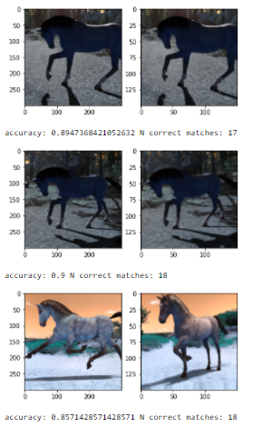

# Image Hashing and Matching Algorithm

Inspired by Apple's CSAM image hashing algorithm, I decided build an image identifier database using the flowers_dataset and neural network image hashing algorithm. I made the hashing algorithm match transformed images, i.e., 5% horizontal\vertical shift, 5 degree rotations (I used a 1 degree rotation while training). The algorithm got around 80-90% accuracy, for the closest match, on freshly transformed images on the same dataset, flowers_dataset. I used the horses_or_humans dataset (a very comical looking dataset) as validation, and it got 75%-90% accuracy on the closest match.

I inspected the embedding and found that the network removed the background and applied a filter on the main object in the image. It performed poorly when the image had a uniform pattern.

I mainly use this resource as a reference when building this model: [Metric learning for image similarity search](https://keras.io/examples/vision/metric_learning/)

Here is a sample of the output:

